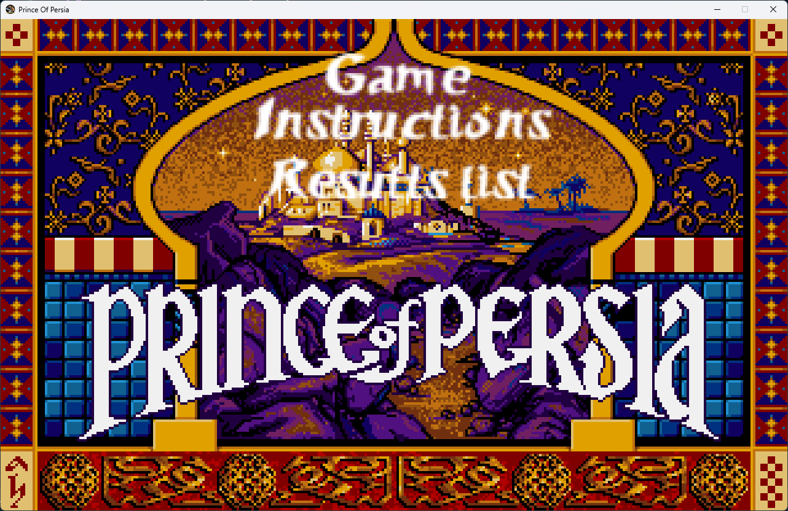
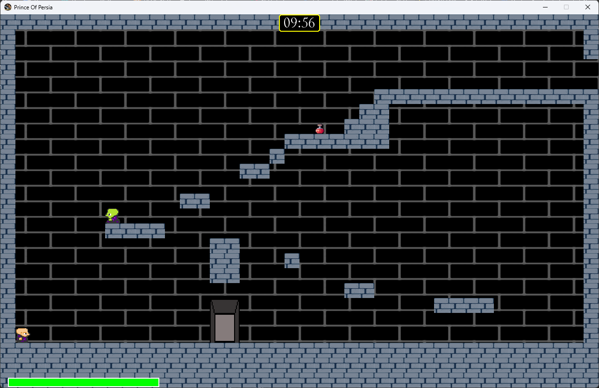

# 🎮 Prince of Persia - Gra 2D 🏰

## 📝 Opis projektu
Prince of Persia to dwuwymiarowa gra platformowa stworzona w Pythonie przy użyciu biblioteki **Pygame**. Projekt inspirowany jest klasyczną grą *Prince of Persia* i oferuje dynamiczną rozgrywkę, w której gracz musi pokonywać przeszkody, walczyć z przeciwnikami i przechodzić przez kolejne poziomy. ⚔️🏆

Gra zawiera system animacji postaci, fizykę ruchu, różne rodzaje przeciwników oraz interaktywne elementy otoczenia. Dzięki zaimplementowanemu systemowi zapisów, gracze mogą konkurować o jak najlepsze wyniki. 🏅

## 🖼️ Zrzuty ekranu

### 📜 Menu główne


### 🏰 Przykładowy poziom



## 🌟 Funkcjonalności
- 🎨 **Grafika 2D** – sprite'y postaci, przeciwników i otoczenia.
- 🏃 **Platformowa mechanika gry** – skakanie, walka, unikanie przeszkód.
- 🏺 **Interakcja z przedmiotami** – zbieranie mikstur, broni.
- 🦹 **Przeciwnicy i walka** – różnorodni przeciwnicy z unikalnymi wzorcami ataku.
- ❤️ **System zdrowia i punktacji** – gracz i przeciwnicy mają punkty życia.
- 🔥 **Zmienna trudność** – poziomy mogą stawać się trudniejsze z każdą kolejną rozgrywką.
- 🏰 **Różne poziomy gry** – unikalne plansze i sekrety do odkrycia.
- 🎵 **System audio** – dźwięki otoczenia, efekty dźwiękowe walki oraz muzyka w tle.

## 💻 Wymagania systemowe
- 🐍 Python 3.x
- 🕹️ Pygame

## 🚀 Instalacja
1. **Klonowanie repozytorium**:
   ```sh
   git clone https://github.com/Redor144/Prince_Of_Persia
   cd prince-of-persia
   ```
2. **Instalacja zależności**:
   ```sh
   pip install pygame
   ```
3. **Uruchomienie gry**:
   ```sh
   python main.py
   ```

## 🎮 Sterowanie
- ⬅️➡️ **Strzałki w lewo i w prawo** – ruch postaci
- 🔼 **Strzałka w górę** – skok
- 🏺 **Strzałka w dół** – interakcja z otoczeniem (zbieranie przedmiotów)
- ⚔️ **Spacja** – atak mieczem
- ❌ **ESC** – wyjście z gry

## 📁 Struktura projektu
```
Prince_Of_Persia/
│── 🎬 main.py          # Główne wejście do gry
│── 🏠 menu.py          # Obsługa menu głównego
│── 🎮 game.py          # Pętla gry i zarządzanie poziomami
│── 🏃 player.py        # Logika postaci gracza
│── 🦹 enemy.py         # Przeciwnicy i ich zachowania
│── 🏺 items.py         # Przedmioty w grze
│── 🗺️ mapa.py          # Mapowanie poziomów
│── ⚙️ config.py        # Ustawienia gry
│── 🏆 high_scores.json # Zapis najlepszych wyników
│── 🎨 resources/          # Pliki graficzne i dźwiękowe
```

## 🐞 Znane błędy i problemy
- 🚧 **Kolizje postaci z otoczeniem** – sporadyczne przenikanie przez ściany.
- 🤖 **AI przeciwników** – niektórzy przeciwnicy mogą czasem utknąć w jednym miejscu.
- 🖥️ **Optymalizacja** – możliwe lekkie spadki FPS na starszych komputerach.

## 🔮 Plany rozwoju
- ✨ Dodanie nowych poziomów oraz bardziej zaawansowanych przeciwników.
- 👥 Implementacja trybu kooperacyjnego dla dwóch graczy.
- ⚔️ Ulepszenie systemu walki oraz dodanie nowych umiejętności postaci.
- 🏰 Rozszerzenie interakcji z otoczeniem (więcej rodzajów pułapek, sekretów).
- 🖥️ Dostosowanie gry do większej liczby platform (Linux, MacOS).

## 👤 Autor
Projekt stworzony jako projekt zespołowy na potrzeby przedmiotu **Programowanie w języku Python** prowadzonego na AGH UST. 🎨

## 📜 Licencja
Projekt dostępny na licencji MIT. 📄

